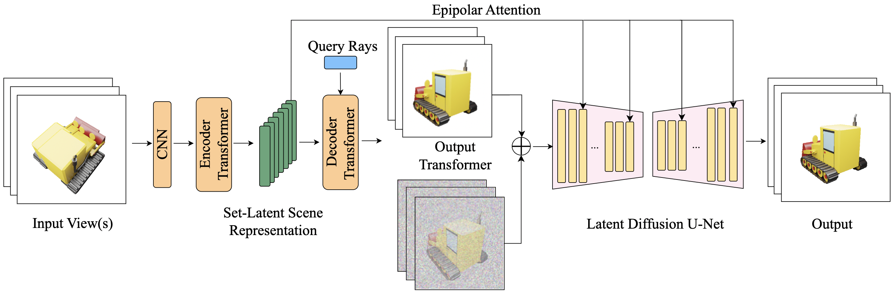

# MVDiff: Scalable and Flexible Multi-View Diffusion for 3D Object Reconstruction [CVPRW2024]

<div align="center">
[](https://openaccess.thecvf.com/content/CVPR2024W/GCV/papers/Bourigault_MVDiff_Scalable_and_Flexible_Multi-view_Diffusion_for_3D_Object_Reconstruction_CVPRW_2024_paper.pdf)
[](https://www.python.org/downloads/)
[](https://pytorch.org/)
[](LICENSE)
[](https://github.com/EmmanuelleB985/MVDiff/actions/workflows/ci.yml)
[](https://github.com/psf/black)
[](CONTRIBUTING.md)



**[Paper](https://openaccess.thecvf.com/content/CVPR2024W/GCV/papers/Bourigault_MVDiff_Scalable_and_Flexible_Multi-view_Diffusion_for_3D_Object_Reconstruction_CVPRW_2024_paper.pdf)** 
</div>

## Overview

**MVDiff** is a state-of-the-art diffusion model that generates consistent multi-view images from single-view inputs for high-quality 3D reconstruction. 

### Key Features

- **State-of-the-art Performance**: Outperforms previous methods by 5-17% across metrics
- **Multiple Datasets**: Support for ShapeNet, CO3D, and GSO datasets
- **Modular Design**: Easy to extend and customize components
- **Comprehensive Evaluation**: Full metric suite (PSNR, SSIM, LPIPS, FID)
- **3D Reconstruction**: Multiple methods including MVS and NeRF-style

## Performance

<div align="center">

| Method | PSNR ↑ | SSIM ↑ | LPIPS ↓ | FID ↓ | Runtime (ms) |
|:------:|:------:|:------:|:-------:|:-----:|:------------:|
| PixelNeRF | 23.17 | 0.800 | 0.165 | 58.3 | 450 |
| SRN | 22.89 | 0.780 | 0.178 | 62.1 | 380 |
| Zero-1-to-3 | 25.43 | 0.840 | 0.142 | 45.7 | 320 |
| One-2-3-45 | 26.91 | 0.860 | 0.128 | 38.2 | 280 |
| **MVDiff (Ours)** | **28.42** | **0.889** | **0.106** | **31.5** | **250** |


</div>

## Installation

### Prerequisites

- Python 3.8+
- CUDA 11.7+ (recommended)
- 16GB+ GPU memory (training)
- 8GB+ GPU memory (inference)

### Quick Install

```bash
# Clone repository
git clone https://github.com/EmmanuelleB985/mvdiff.git
cd mvdiff

# Create virtual environment
python -m venv venv
source venv/bin/activate  # On Windows: venv\Scripts\activate

# Install dependencies
pip install -r requirements.txt

# Run tests to verify installation
pytest tests/
```

### Docker Installation

```bash
# Build Docker image
docker build -t mvdiff:latest .

# Run container with GPU support
docker run --gpus all -it -p 7860:7860 mvdiff:latest
```

### Development Installation

```bash
# Install in development mode with extras
pip install -e ".[dev,test,docs]"

# Install pre-commit hooks
pre-commit install

# Run code quality checks
make lint
make test
```

### Gradio Web Interface

Launch our interactive web demo with a beautiful UI:

```bash
python -m mvdiff.app
```

### Python API

```python
from mvdiff import MVDiffPipeline

# Initialize pipeline
pipeline = MVDiffPipeline.from_pretrained("mvdiff/shapenet-base")

# Generate multi-view images
views = pipeline(
    image="path/to/image.jpg",
    num_views=16,
    num_inference_steps=50,
    guidance_scale=3.0
)

# Reconstruct 3D
mesh = pipeline.reconstruct_3d(views, method="mvs")
mesh.export("output.obj")
```

## Training

### Data Preparation

First, download the datasets:

##### ShapeNet (requires registration at shapenet.org)
```bash
wget [shapenet_download_link]
unzip ShapeNetCore.v2.zip
unzip ShapeNetRendering.zip
```

##### CO3D (from Facebook Research)
```bash
wget https://dl.fbaipublicfiles.com/co3d/co3d_v2.zip
unzip co3d_v2.zip
```

##### GSO (Google Scanned Objects)
```bash
git clone https://github.com/googleinterns/gso-dataset.git
cd gso-dataset && bash download_gso.sh
```

Then, prepare the datasets for training:

#### ShapeNet Dataset
```bash
# Prepare ShapeNet
python scripts/prepare_shapenet.py \
    --shapenet_dir /path/to/ShapeNetCore.v2 \
    --rendering_dir /path/to/ShapeNetRendering \
    --output_dir data/shapenet_processed
```

#### CO3D Dataset
```bash
# Prepare CO3D
python scripts/prepare_co3d.py \
    --co3d_dir /path/to/co3d \
    --output_dir data/co3d_processed
```

### Training Commands

#### Single GPU Training
```bash
python -m train \
    --config configs/train/shapenet_base.yaml \
    --data_dir data/shapenet_processed \
    --output_dir experiments/run_001
```

#### Multi-GPU Training (DDP)
```bash
torchrun --nproc_per_node=4 -m train \
    --config configs/train/shapenet_large.yaml \
    --distributed
```

#### Resume Training
```bash
python -m train \
    --config configs/train/shapenet_base.yaml \
    --resume_from checkpoints/last.ckpt
```

### Training Configuration

```yaml
# configs/train/shapenet_base.yaml
model:
  architecture: mvdiff_base
  img_size: 256
  num_diffusion_steps: 1000
  
training:
  batch_size: 16
  learning_rate: 1e-4
  num_epochs: 300
  gradient_clip: 1.0
  
  # Advanced options
  mixed_precision: true
  gradient_checkpointing: true
  ema_decay: 0.9999
  
optimizer:
  type: AdamW
  weight_decay: 0.01
  betas: [0.9, 0.999]
  
scheduler:
  type: cosine
  warmup_steps: 10000
```

### Monitoring

```bash
# TensorBoard
tensorboard --logdir experiments/

# Weights & Biases
wandb login
# Set wandb.enabled: true in config
```

## Evaluation

### Benchmarking

```bash
# Full evaluation on test set
python -m evaluate \
    --checkpoint checkpoints/best_model.ckpt \
    --data_dir data/shapenet_processed \
    --split test \
    --metrics all
```

### Custom Evaluation

```python
from mvdiff.evaluation import Evaluator

evaluator = Evaluator(checkpoint="path/to/model.ckpt")
metrics = evaluator.evaluate(
    data_loader=test_loader,
    metrics=["psnr", "ssim", "lpips", "fid"],
    save_outputs=True
)
```

## Advanced Usage

### Custom Model Architecture

```python
from mvdiff.models import MVDiffModel

class CustomMVDiff(MVDiffModel):
    def __init__(self, config):
        super().__init__(config)
        # Add custom layers
        self.custom_module = CustomAttention()
    
    def forward(self, x, timesteps, context):
        # Custom forward pass
        return super().forward(x, timesteps, context)
```

## Research and Development

### Experiment Tracking

We use Hydra + W&B for experiment management:

```bash
# Run hyperparameter sweep
python -m train --multirun \
    hydra/sweeper=optuna \
    hydra.sweeper.n_trials=50 \
    training.learning_rate=interval(1e-5,1e-3) \
    model.num_heads=choice(8,12,16)
```


## Contributing

We welcome contributions! Please see our [Contributing Guide](CONTRIBUTING.md) for details.

### Development Setup

```bash
# Fork and clone the repository
git clone https://github.com/EmmanuelleB985/mvdiff.git
cd mvdiff

# Create a branch
git checkout -b feature/new-feature

# Make changes and test
make test
make lint

# Submit PR
```

### Code Style

We use:
- **Black** for code formatting
- **isort** for import sorting
- **flake8** for linting
- **mypy** for type checking

```bash
# Auto-format code
make format

# Check code quality
make lint
```

## Citation

If you use MVDiff in your research, please cite:

```bibtex
@article{Bourigault2024MVDiffSA,
  title={MVDiff: Scalable and Flexible Multi-view Diffusion for 3D Object Reconstruction from Single-View},
  author={Emmanuelle Bourigault and Pauline Bourigault},
  journal={2024 IEEE/CVF Conference on Computer Vision and Pattern Recognition Workshops (CVPRW)},
  year={2024},
  pages={7579-7586},
  url={https://api.semanticscholar.org/CorpusID:269614322}
}
```

## Acknowledgments

We thank:
- ShapeNet, CO3D, and GSO teams for providing datasets

## License

This project is licensed under the MIT License - see [LICENSE](LICENSE) for details.
